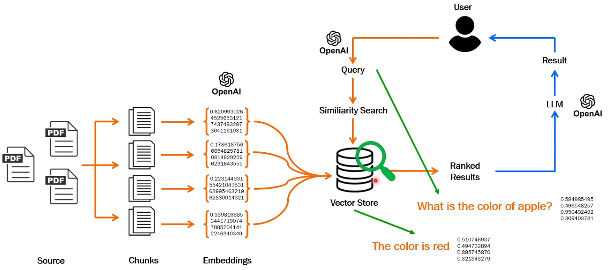

Build our own ChatBot
---

- We will build our own **RAG ChatBot** using `OpenAI GPT LLM`, `Langchain`, `Streamlit`.

This is our Architecture

1. **Data Source** - We will provide our data only. This model wouldn't use Intenet Data like RAG due to org policy may applied.

2. **Chunck** - Data will devided into small chuncks to easily process by LLM.

3. **Embeddings** - This small chuncks will converted into numbers. 
                  - This process we will use OpenAI.

4. **Vector Store** - This Embeddings numbers will stores into Vector Store.

5. **User Initiate** - User will ask a questions to ChatBot `What is color of Apple ?`
                     - This questions will converted into numbers **Embedded** and stored into vector stores.
                     - And look for very similar or very nearest `vector numbers` into vector stores and gives output

6. **LLM** - LLM will formate your ans, process it from lot of transformar layers, work for specific tasks and give you better result.