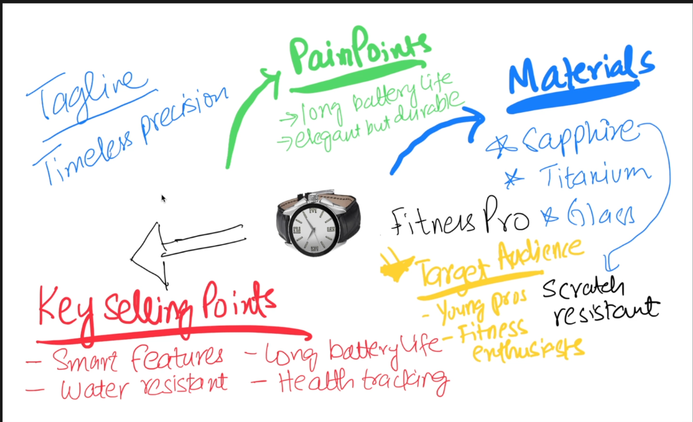

Generative AI & Prompt Engineering
---

`WriteSonic AI` - To write Professional email, reports with added human nuances , politely within single click.

- Instead of `WriteSonic AI` - If you use chatGPT - You will ask to chatGPT atleast 3 times to rewrite email with added human nuances, Make it Professional tone, make it structure for list of query asking in emails.

- `WriteSonic AI` - Will give you professional, formal and more tones, structured email within single click.

- You can integrate within your Gmail - By adding Chrome Extenstions.
- Free Trails - for 7 Days.
- After it will paid.

AI for Summarizing
---

## Summarizations Types

### 1. Extractive

- It will Extract `Sentences`, `word for word` from original text in prompt.

- It will copy and paste important lines.

- For instance, `"A new study shows that drinking green tea daily can improve brain functions and reduce stress."`

**Extractive Summary** - `"Drinking green tea improves brain functions and reduce stress."`

### 2. Abstractive 

Rewriting in your own words

- It understands the meaning and creates a new, shorter versions with the same msg.

- It will RePharse and summarize in new words. It will not copy main sentances.

- For instance, `"A new study shows that drinking green tea daily can improve brain functions and reduce stress."`

**Abstractive Summary** - `"Research suggests that daily green tea consumptions boosts mental health."`

- **ChatGPT** is `doing Abstractive Summarizations`.

Crafting Effective Summarizations Prompts
---

- Whenever you want to do summarizations on a long docs or short docs, You should instruct to AI like ChatGPT, to do summarize for short with bullet point formate, in words and provide context like for in behalf of whom you want to summarize.

  1. Summary Type - Bullet Point, Key names etc.
  2. Limit Words - Summarize this within 300 words.
  3. Context - Who will varify this summarized docs, a Manager, Executive, Which role is play a important role ?

For instance, `"Give a 50 words, bullet point summary of this blog to share  with an executive."`

`1. Summary Type` - Bullet Points.
`2. Limit Words` - Give a 50 wrods.
`3. Context` - To share with an Executive.

AI for Extracting Text and Data from Brainstorming Sessions
---

We will learn how We can extract, summarize and digitize whiteboard notes.

- When you take a picture of Whiteboard notes, It's not a searchable within that image.

- Manually typing MoM summaries is a time consuming

- Ideas get lost or Forgotten and there is no structured follow up.

How AI can helps us for this efforts ?
---

- `Text extractions` - Using OCR (Optical character recognitions) by using ChatGPT, Microsoft OneNote, notability

- `Summarizations` - ChatGPT, Microsoft Copilot, Cluade can summarize extracted text into structured action points.

  - You can trun scattered whiteboard notes into key takeaways or MoM

- `Structuring and Formatting` - AI Can categorize and organize ideas.

  - You can converts raw notes into a project roadmap, to do list or structured docs.

**DEMO**

    - `"Summarize this brainstormed whiteboard notes into MoM formate with key takeaways and add sections"`

    ## 📌 Minutes of Meeting (MoM)

**Project:** FitnessPro Smartwatch
**Date:** [Add Date]
**Attendees:** [Add Names]
**Objective:** Define product positioning, key selling points, materials, and target audience for the FitnessPro smartwatch.

---

## 1️⃣ Agenda

* Product positioning (Tagline & Branding)
* Identify customer pain points
* Define key selling points
* Finalize materials & durability focus
* Clarify target audience

---

## 2️⃣ Discussion Summary

### A. Product Positioning

* **Tagline Idea:** *Timeless Precision*
* Blend of **elegance + technology**
* Focus on both **style and performance**

---

### B. Identified Pain Points

* Short battery life in existing smartwatches
* Lack of durability in stylish watches
* Need for both elegance and strong build quality

---

### C. Key Selling Points

* Smart features
* Long battery life
* Water resistance
* Health tracking capabilities
* Scratch-resistant design

---

### D. Materials Discussion

* Sapphire glass
* Titanium body
* High-quality protective glass
* Emphasis on scratch resistance and durability

---

### E. Target Audience

* Young professionals
* Fitness enthusiasts
* Users seeking stylish yet durable smartwatches

---

## 3️⃣ Key Takeaways

* Product must balance **premium design + durability**
* Long battery life is a major differentiator
* Strong material selection (Sapphire + Titanium) supports premium positioning
* Target audience prefers performance-driven yet elegant wearables
* Marketing should highlight *“Timeless Precision”* theme

---

## 4️⃣ Action Items

| Action                             | Owner          | Timeline |
| ---------------------------------- | -------------- | -------- |
| Finalize product tagline           | Marketing Team | TBD      |
| Validate material cost feasibility | Product Team   | TBD      |
| Define detailed feature list       | Engineering    | TBD      |
| Create initial branding mockups    | Design Team    | TBD      |

---

## 5️⃣ Next Steps

* Conduct competitor analysis
* Estimate pricing strategy
* Develop prototype concept
* Prepare marketing positioning draft

---

If you'd like, I can also convert this into:

* 📄 Professional PDF
* 📊 PPT presentation format
* 📋 Confluence-ready documentation format
* 📑 Investor pitch summary

Just tell me which format you prefer.

  
  - `"convert this into Actionalbe items . ALso explain what is actionable items ?"`

## ✅ What Are Actionable Items?

**Actionable items** are specific tasks that:

* Clearly state **what needs to be done**
* Have a defined **owner**
* Have a **deadline**
* Lead to measurable progress

👉 Unlike discussion points (ideas), actionable items are **execution-focused** and directly move the project forward.

Example:

❌ *Discussion Point:* “We should improve battery life.”
✅ *Actionable Item:* “Engineering team to design battery optimization plan to achieve minimum 7-day battery life by March 15.”

---

# 📌 Actionable Items – FitnessPro Smartwatch

## 1️⃣ Product Strategy

1. **Finalize Tagline**

   * Owner: Marketing Team
   * Task: Evaluate “Timeless Precision” and shortlist 3 alternatives
   * Deadline: 1 week

2. **Define Product Positioning Statement**

   * Owner: Marketing + Product Team
   * Task: Create a 1-paragraph positioning statement targeting young professionals & fitness users
   * Deadline: 1 week

---

## 2️⃣ Battery & Performance

3. **Set Battery Life Target**

   * Owner: Engineering Team
   * Task: Define minimum battery benchmark (e.g., 5–7 days normal usage)
   * Deadline: 3 days

4. **Battery Feasibility Analysis**

   * Owner: Hardware Team
   * Task: Evaluate battery size vs device thickness tradeoff
   * Deadline: 1 week

---

## 3️⃣ Materials & Durability

5. **Material Cost Comparison**

   * Owner: Procurement Team
   * Task: Compare cost of Sapphire vs Gorilla Glass vs Standard Glass
   * Deadline: 5 days

6. **Titanium Body Feasibility Study**

   * Owner: Product Engineering
   * Task: Analyze durability, weight, and cost impact
   * Deadline: 1 week

7. **Scratch & Water Resistance Certification Plan**

   * Owner: QA Team
   * Task: Identify certification standards (e.g., IP rating target)
   * Deadline: 1 week

---

## 4️⃣ Features & Health Tracking

8. **Define Smart Feature List**

   * Owner: Product Team
   * Task: Finalize list (health tracking, fitness modes, notifications, etc.)
   * Deadline: 5 days

9. **Health Tracking Capability Study**

   * Owner: Engineering Team
   * Task: Identify sensors required (HR, SpO2, etc.)
   * Deadline: 1 week

---

## 5️⃣ Target Audience Validation

10. **Market Research Survey**

    * Owner: Marketing Team
    * Task: Conduct survey among young professionals & fitness enthusiasts
    * Deadline: 2 weeks

11. **Competitor Benchmarking**

    * Owner: Strategy Team
    * Task: Compare with top 5 smartwatch competitors on battery, durability, price
    * Deadline: 1 week

---

## 6️⃣ Branding & Go-To-Market

12. **Create Initial Design Mockups**

    * Owner: Design Team
    * Task: Develop 2–3 premium design concepts
    * Deadline: 10 days

13. **Draft Marketing Messaging**

    * Owner: Marketing Team
    * Task: Highlight long battery life + durability + elegance
    * Deadline: 1 week

---

# 🎯 Final Result

After completing these actionable items, you will have:

* Clear product positioning
* Defined battery target
* Material cost validation
* Confirmed feature set
* Validated target audience
* Initial marketing strategy

- `"Please identify any key gaps or important aspects that we have missed during the brainstorming sessions"`

Great question 👏 — this is exactly how strong product planning is done.

Below is a structured **gap analysis** of what may be missing from your smartwatch brainstorming session.

---

# 🔎 Key Gaps Identified

## 1️⃣ Pricing Strategy (Major Gap)

You discussed:

* Premium materials (Sapphire, Titanium)
* Target audience (young professionals, fitness enthusiasts)

❌ Missing:

* Target price range
* Cost vs margin strategy
* Premium vs mid-range positioning decision

**Why it matters:**
Titanium + Sapphire = high cost.
If your target audience is young professionals, affordability must be considered.

---

## 2️⃣ Competitive Positioning

❌ Missing:

* Who are your top 3 competitors?
* What exact gap are you filling?
* Why should users switch from existing brands?

You need:

* Feature comparison table
* Clear differentiation strategy

---

## 3️⃣ Operating System & Ecosystem

❌ Missing:

* Android compatibility?
* iOS compatibility?
* Custom OS or Wear OS?
* App ecosystem support?

This is critical for:

* User adoption
* App integrations
* Notifications & syncing

---

## 4️⃣ User Experience (UX)

You mentioned features, but not:

❌ Missing:

* Screen size & display type (AMOLED / LCD?)
* Always-on display?
* UI simplicity?
* Touch + physical buttons?

Durability + battery + premium feel must reflect in UX design.

---

## 5️⃣ Manufacturing & Supply Chain

❌ Missing:

* Manufacturing location
* Supplier identification
* Production scalability
* Quality control plan

Premium materials increase production complexity.

---

## 6️⃣ After-Sales & Warranty Strategy

❌ Missing:

* Warranty period (1 year? 2 years?)
* Replacement policy
* Service centers?
* Software update plan?

Durability claim must be backed by service confidence.

---

## 7️⃣ Software & Updates Strategy

❌ Missing:

* OTA updates?
* Security patch frequency?
* AI features?
* Future feature roadmap?

Modern smartwatches compete heavily on software experience.

---

## 8️⃣ Regulatory & Certifications

❌ Missing:

* Bluetooth certification
* CE / FCC approvals
* Health sensor certifications
* IP rating (IP67 / IP68?)

Without certifications → cannot sell globally.

---

## 9️⃣ Battery Charging Strategy

You discussed long battery life but:

❌ Missing:

* Fast charging?
* Wireless charging?
* Magnetic dock?
* Charging time (0–100%)?

Users care about convenience as much as battery life.

---

## 🔟 Go-To-Market Strategy

❌ Missing:

* Online only or retail?
* Launch geography?
* Influencer marketing?
* Fitness partnerships?

---

# 🎯 Strategic Gaps Summary

Your brainstorming focused strongly on:
✔ Materials
✔ Durability
✔ Battery
✔ Target audience

But missed:
⚠ Business model
⚠ Software ecosystem
⚠ Pricing
⚠ Competition
⚠ Operational execution

---

# 🧠 Most Critical Gaps to Fix First

If I prioritize for you:

1. Pricing Strategy
2. Competitive Differentiation
3. OS & Ecosystem Decision
4. Battery + Charging UX
5. Regulatory Plan

