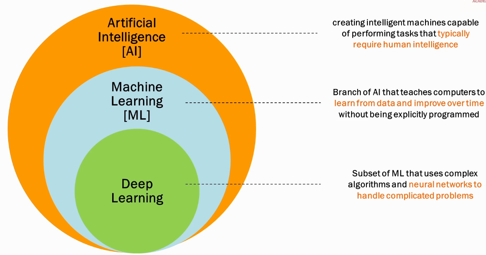

What is Generative AI ?
---

- It is combinations of `Generative` and `AI`.

- It is beyond one step to AI and it will generate some new content using AI for you.

- For Instance, 
1. Ask for wirte a mail for Refund,
2. Text to Image, Photo, Video,
3. Generate DevOps related code like python code, github actions code.

- Generative AI is a type of AI that can `create new contents` such as `audio`, `images`, `text`, `code`, `video`.

What is pre-requisite should required to explore Generative AI ?
---

1. `Artificial Intelligence`
2. `Machine Learning`
3. `Deep Learning`

1. Artificail Intelligence - Is a development of machines that perform tasks that requires human intelligence.

- For instance, You can create AI System that can diagnosis deases from x-ray or they can predict, Or they can detect Credit Cards Frauds.

But, How machines can be intelligence as humans ?

- Here, `Machine Learning` comes into pictures.

2. Machine Learning 

- You are trying to make machine to learn something.
- Train the machine in a such a way that they can make predictions, decisions all by learning itself and work on that tasks without human involvement.

  1. Lots of training data
  - To trains machines, you will requires a lot of data to learn the machines

  2. computational power
  - we will requires a computations powers to store data, process data etc

  3. Algorithms
  - This is a way to learn the model , machines to make decisions, identify patterns, process the data.

3. Deep Learning

- Deep learning is a subset of machine learning that focuses on teaching computers to learn and make decisions by processing data through `neural networks` to gives you much much highly accurate and better results 

- For Instance, I asked to ChatGPT what is LLM ?
- It gives me ans with Bullet Points and generate new content by using AI and LLM behind the scenes.

- While i ask How they build ?
- It will not ask you that `What did you ask for How they build means what ?`
- Bcz, Generative AI, Deep Learning model has remember your questions and from their it will learns from histroy, process it, generate new contents.

What is LLM ?
---

- Large Language Models (LLMs) are AI Models to `Designed for understanding and generating human-like text.

- LLM means they can generate text, process text, they can understand text, they know about words, grammers, sentences, contexts all of this will create accuracy.

